# Mermaid 文档图表 (Mermaid Diagrams)

用 **Mermaid** 文本语法生成**产品文档、技术文档**中的各类图表。Mermaid 可在 GitHub、GitLab、Notion、VS Code、Confluence 等环境中直接渲染，适合放在 Markdown、README、PRD、设计文档中。

## 何时使用

- 用户要求画 **流程图 / 关系图 / 泳道图 / 时序图 / 架构图 / 类图 / 状态图 / ER 图 / 甘特图 / 用户旅程 / 四象限图 / 时间线 / 组织架构 / 用例图**
- 为 **产品文档、技术文档、设计文档、README** 配图
- 需要 **可版本管理、可复制的图表**（文本即图，无需贴图片文件）

---

## 产品 / 技术文档与图表选择

| 文档需求 | 推荐图表类型 | 本节编号 |
|----------|--------------|----------|
| 流程、步骤、分支判断 | 流程图 | 1 |
| 概念/模块/角色之间的关系、依赖、归属 | 关系图（flowchart） | 2 |
| 跨角色、跨部门的流程（谁在什么时候做什么） | 泳道图（flowchart + subgraph） | 3 |
| 系统/组件/人之间的调用、交互顺序 | 时序图 | 4 |
| 类、接口、对象结构 | 类图 | 5 |
| 数据实体及关系 | ER 图 | 6 |
| 状态机、生命周期、工作流状态 | 状态图 | 7 |
| 项目排期、里程碑 | 甘特图 | 8 |
| 用户旅程、体验阶段、任务与体验分数 | 用户旅程图 | 9 |
| 优先级矩阵、四象限分析（如 价值–成本） | 四象限图 | 10 |
| 产品/版本路线图、大事记、时间顺序 | 时间线 | 11 |
| 组织架构、汇报关系 | flowchart 自上而下 | 12（其他） |
| 用例、角色–系统–功能 | flowchart 模拟 | 12（其他） |

---

## 图表类型与语法要点

### 1. 流程图 (flowchart)

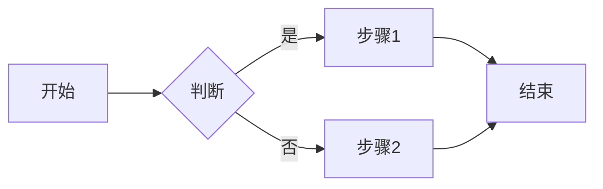

- 方向：`TB`(上下)、`LR`(左右)、`BT`、`RL`
- 节点：`[矩形]`、`(圆角)`、`{菱形}`、`([体育场])`、`[(圆柱)]`
- 连线：`-->`、`---`、`-.->`、`==>`；`|文案|` 为连线标注

### 2. 关系图（概念 / 模块 / 角色关系）

用 **flowchart** 表示产品模块、概念、角色之间的**依赖、归属、关联**（非数据实体用 ER 图）。

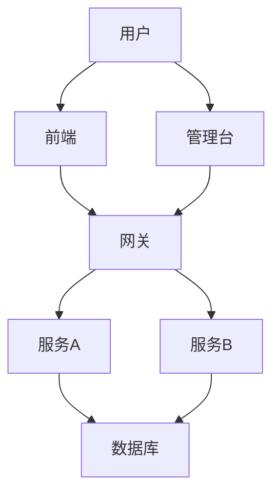

- 节点：模块名、概念名、角色名；连线表示依赖、调用、归属等，可用 `|标注|` 说明关系类型。
- 方向：`TB` 适合层级/归属，`LR` 适合从左到右的依赖链。

### 3. 泳道图（跨角色 / 跨部门流程）

用 **flowchart + subgraph**：每个 `subgraph` 为一个**泳道**（角色或部门），其内为该泳道的步骤；跨 subgraph 的箭头表示跨角色交接。

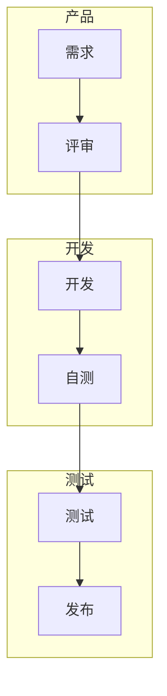

- `subgraph 泳道名` … `end`；泳道内节点按流程连，跨泳道用 `A2 --> B1` 等。

### 4. 时序图 (sequenceDiagram)

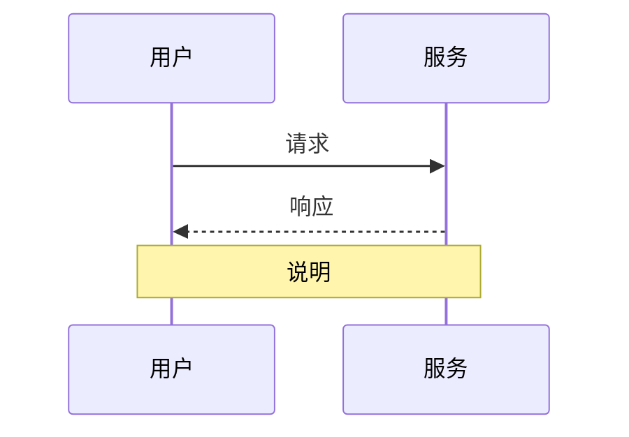

- `->>` 实线箭头，`-->>` 虚线箭头；`Note over A,B: 文本`、`alt/else/end`、`loop/end`、`opt/end`

### 5. 类图 (classDiagram)

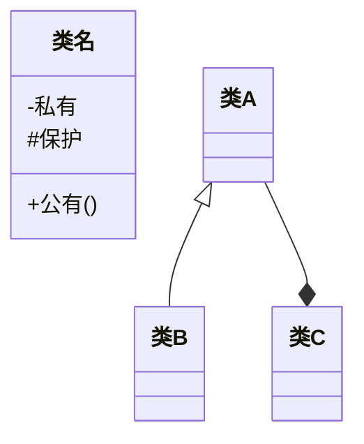

- 关系：`<|--` 继承、`*--` 组合、`o--` 聚合、`-->` 关联、`--` 链接

### 6. ER 图 (erDiagram)

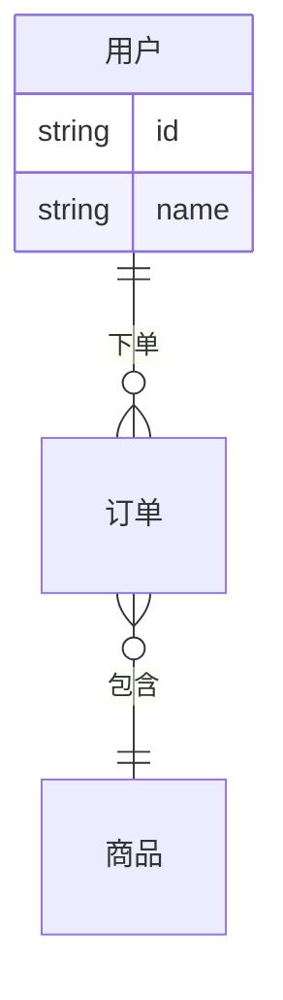

### 7. 状态图 (stateDiagram-v2)

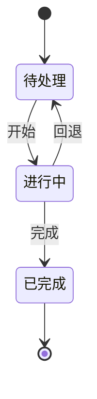

### 8. 甘特图 (gantt)

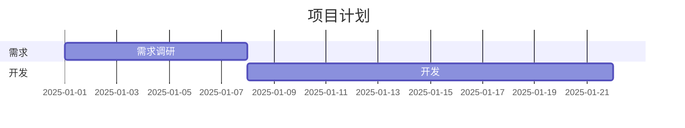

### 9. 用户旅程图 (journey)

用于**产品文档**中的用户旅程、体验阶段、任务与满意度；`section` 为阶段，`任务: 分数: 角色`，分数 1–5 表示体验程度。

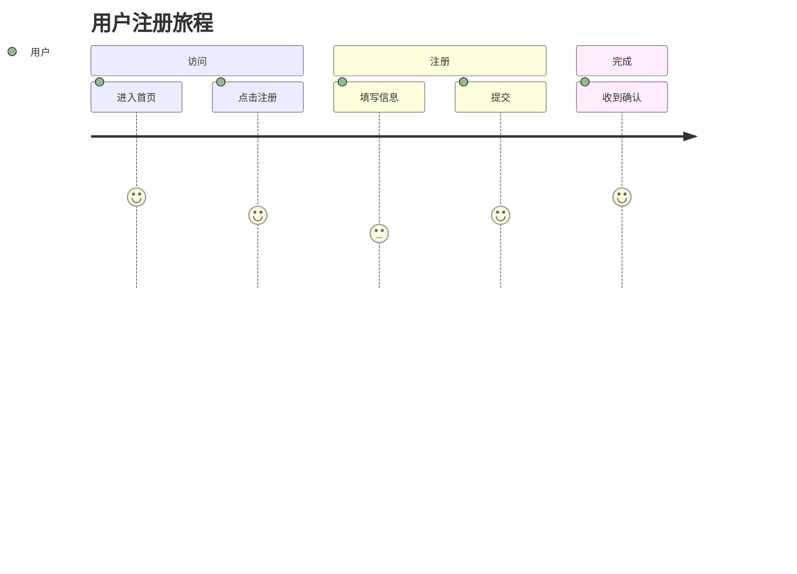

- 语法：`journey`、可选 `title 标题`、`section 阶段名`、`任务名: 分数: 角色1, 角色2`（分数 1–5）

### 10. 四象限图 (quadrantChart)

用于**优先级矩阵、四象限分析**（如 价值–成本、重要性–紧急度）。`x-axis`、`y-axis` 为两轴标签；`quadrant-1`～`quadrant-4` 为四块文案；`名称: [x, y]` 为点的坐标（0–1）。

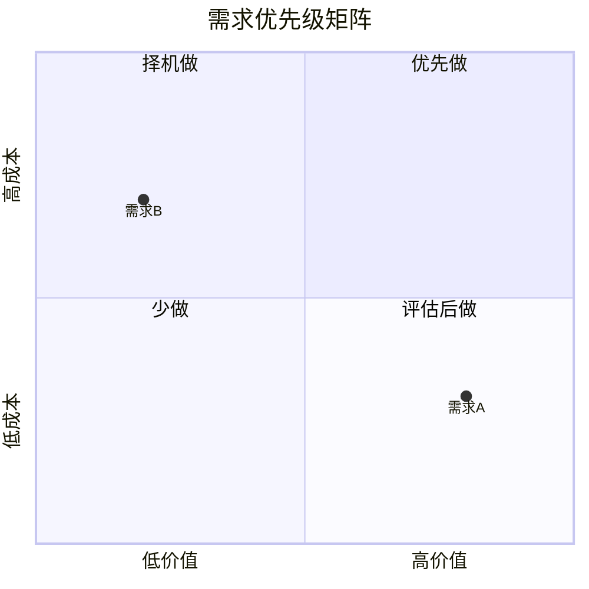

### 11. 时间线 (timeline)

用于**产品/版本路线图、大事记、按时间顺序的事件**。`timeline`、可选 `title`；`时期 : 事件` 或 `时期 : 事件1 : 事件2`；`section 分组名` 可把时期归组。

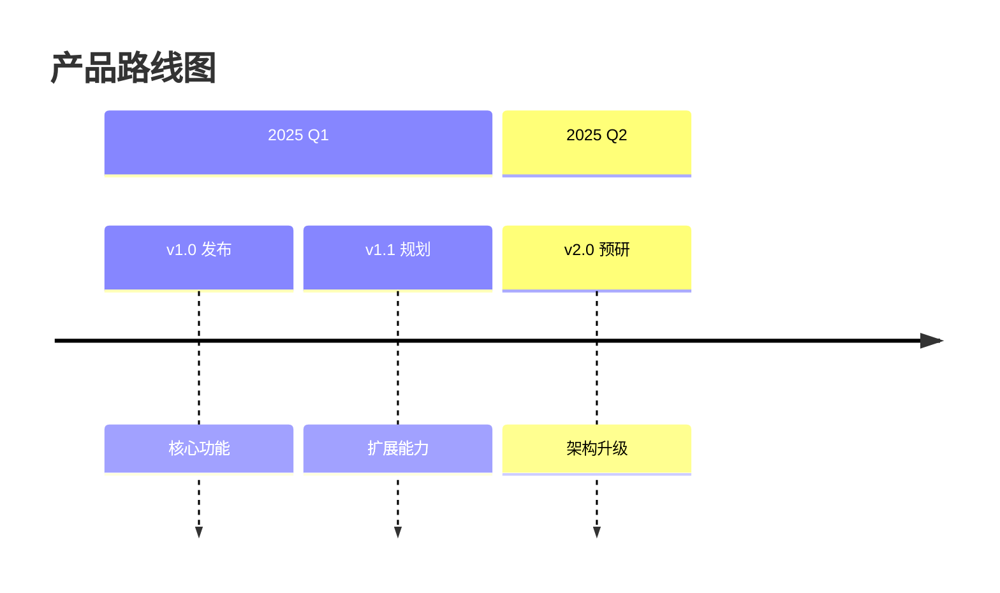

- 注意：`timeline` 为实验性语法，部分渲染环境可能不支持；若不支持，可用 **gantt** 或 **flowchart** 做简化时间线。

### 12. 其他

- **饼图**：`pie title 标题` + `"标签" : 数值`
- **组织架构图**：用 **flowchart TB**，自上而下用 `-->` 或 `---` 表示汇报/层级关系。
- **用例图**：Mermaid 无专用语法，用 **flowchart** 模拟：节点为 角色、用例、系统，连线表示「参与」或「包含」。
- **C4 / 架构层级**：用 `flowchart` 或 `C4Context`（视渲染环境）；`flowchart` 的 subgraph 可表达层级。
- **思维导图**：`mindmap`（部分环境支持）。

---

## 使用与输出约定

1. **语法**：严格按 [Mermaid 官方语法](https://mermaid.js.org/syntax/flowchart.html)，避免不支持的写法；`journey`、`quadrantChart`、`timeline` 等在部分环境可能不支持，可说明或改用 flowchart/gantt 替代。
2. **代码块**：产出时用 Markdown 代码块包裹，注明 `mermaid`。
3. **位置**：若用户指定文件则写入；否则在回复中给出可复制的 Mermaid 块，并提示可插入 `README.md`、`docs/xxx.md` 等。
4. **中文**：节点、连线、Note、section、标题等尽量支持中文；遇渲染问题时改用英文或拼音。
5. **复杂度**：图过大时拆成多张子图，或说明「可进一步按模块/阶段拆分」。

## 与 `doc-writing` 的配合

画架构图、关系图、流程图、泳道图、状态图等辅助 **技术方案** 或 **PRD** 时，可同时使用 `doc-writing` 与 `mermaid-diagrams`：本 skill 负责产出 Mermaid 代码，嵌入由 `doc-writing` 生成的文档；**图题、编号、正文引用**按 `doc-writing` 的图表规范执行。
